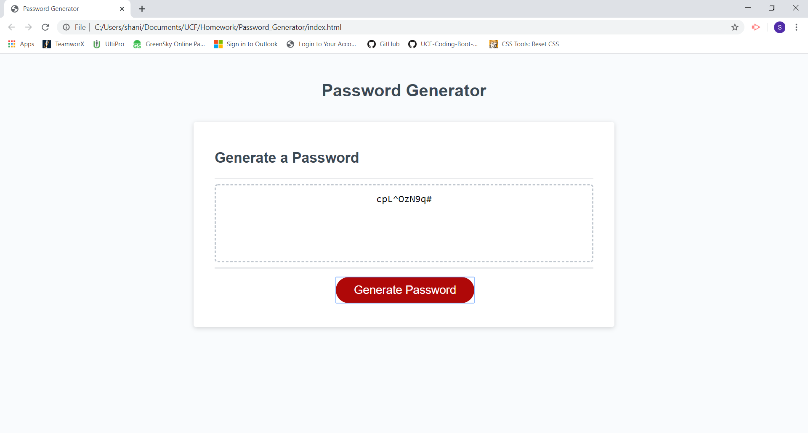

# Password_Generator
# Making a random Password Generator
### I was given the `index.html` and the `style.css` file. My job was to make the generator work by using Javascript

## This is how the generator looks like

## How does it work
### When clicking the Generate Password button there is series of questions that you are going to be asked.
### For example:  

* How many characters do you want the password to have? The characters must be between 8 and 120.
* Do you want lowercase letters?
* Do you want uppercase letters?
* Do you want numbers?

### Then I created If statements to know what kind of characters does the user want to use; like numbers, symbols, lowercase and uppercase.
### If they agreed to some or all the password will include all or some of the characters chosen.
### Then i did a for loop, with Math.floor(Math.random) that way all the characters and number will be chosen random

